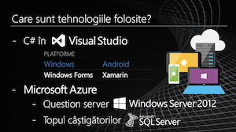
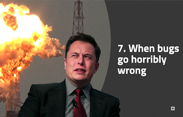
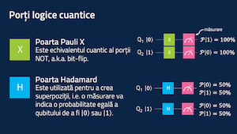
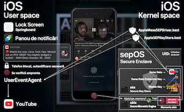

# UniTBv Keynotes
Various keynotes I held between 2018 and 2021 during my studies at the Faculty of Mathematics and Computer Science of the Transilvania University of Brașov.

- [🇷🇴 Altă întrebare?](./Keynotes/Alta%20intrebare.pdf) 

- [🇷🇴 Bug tracking systems](./Keynotes/Sisteme%20de%20bug%20tracking.pdf) 

- [🇷🇴 A brief introduction to quantum computers](./Keynotes/Calculatoare%20cuantice.pdf) 

- [🇷🇴 A deep dive into the iPhone's Secure Enclave](./Keynotes/Secure%20Enclave.pdf) 
